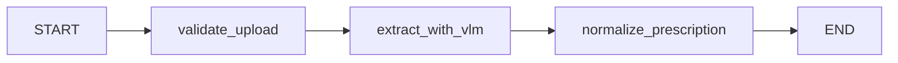
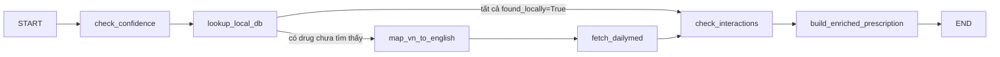
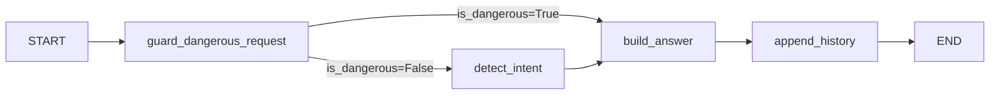

# MedChat — LangGraph Agent Architecture

FastAPI chỉ là lớp HTTP mỏng. Toàn bộ logic nghiệp vụ chạy qua 3 LangGraph graph.

---

## Tổng quan 3 Graph

| Graph | File | Trigger Endpoint | State Type | Nodes (theo thứ tự) |
|-------|------|-----------------|------------|---------------------|
| `scan_graph` | `graphs/prescription_scan.py` | `POST /prescriptions/scan` | `ScanState` | validate_upload → extract_with_vlm → normalize_prescription |
| `confirm_graph` | `graphs/prescription_confirm.py` | `POST /prescriptions/{id}/confirm` | `ConfirmState` | check_confidence → lookup_local_db → [map_vn_to_english → fetch_dailymed] → check_interactions → build_enriched_prescription |
| `chat_graph` | `graphs/chat.py` | `POST /chat` | `ChatState` | guard_dangerous_request → detect_intent → build_answer → append_history |

---

## Graph 1: `scan_graph`

### Flow



### Node Catalog

| Node | File | Đọc từ state | Ghi vào state | Gọi service | Stub? |
|------|------|-------------|--------------|-------------|-------|
| `validate_upload` | `nodes/validate_upload.py` | `mime_type`, `image_bytes` | `image_base64` | — | Không |
| `extract_with_vlm` | `nodes/extract_with_vlm.py` | `image_base64`, `mime_type` | `vision_result` | `vision.extract_prescription_from_image` | Không |
| `normalize_prescription` | `nodes/normalize_prescription.py` | `vision_result` | `prescription` (dict) | `schemas.Medication`, `schemas.Prescription` | Không |

### ScanState

```python
class ScanState(TypedDict, total=False):
    file_name: str
    mime_type: str
    image_bytes: bytes
    image_base64: str
    vision_result: VisionPrescriptionResult
    prescription: dict        # frontend Prescription shape
    errors: list[str]
```

---

## Graph 2: `confirm_graph`

### Flow



### Node Catalog

| Node | File | Đọc từ state | Ghi vào state | Gọi service | Stub? |
|------|------|-------------|--------------|-------------|-------|
| `check_confidence` | `nodes/check_confidence.py` | `raw_medications` | `raw_medications[*].needs_review` | `config.CONFIDENCE_THRESHOLD` | Không |
| `lookup_local_db` | `nodes/lookup_local_db.py` | `raw_medications` | `lookup_results` | `drug_data_service.resolve_to_medication_dict` | Không |
| `map_vn_to_english` | `nodes/map_vn_to_english.py` | `lookup_results[*].found_locally` | `lookup_results[*].english_name` | — | **CÓ** |
| `fetch_dailymed` | `nodes/fetch_dailymed.py` | `lookup_results[*].english_name` | `lookup_results[*].dailymed_data` | DailyMed API | **CÓ** |
| `check_interactions` | `nodes/check_interactions.py` | `lookup_results` | `lookup_results[*].risk_level`, `has_high_risk`, `interaction_warnings` | `safety_service.classify_risk` | Không |
| `build_enriched_prescription` | `nodes/build_enriched_prescription.py` | `raw_medications`, `lookup_results` | `enriched_medications` | — | Không |

### ConfirmState

```python
class DrugLookupResult(TypedDict, total=False):
    raw_name: str
    found_locally: bool
    local_data: dict              # từ drug_data_service
    english_name: str | None      # từ map_vn_to_english (stub)
    dailymed_data: dict | None    # từ fetch_dailymed (stub)
    risk_level: str               # "low" | "medium" | "high"
    safety_flags: list[str]
    needs_specialist: bool

class ConfirmState(TypedDict, total=False):
    prescription_id: str
    raw_medications: list[dict]
    lookup_results: list[DrugLookupResult]
    has_high_risk: bool
    interaction_warnings: list[str]
    enriched_medications: list[dict]
    errors: list[str]
```

---

## Graph 3: `chat_graph`

### Flow



### Node Catalog

| Node | File | Đọc từ state | Ghi vào state | Gọi service | Stub? |
|------|------|-------------|--------------|-------------|-------|
| `guard_dangerous_request` | `nodes/guard_dangerous_request.py` | `question` | `is_dangerous`, `answer` (nếu dangerous) | `agent.is_dangerous_request` | Không |
| `detect_intent` | `nodes/detect_intent.py` | `question` | `intent` | — (regex/keyword) | Không |
| `build_answer` | `nodes/build_answer.py` | `intent`, `medications`, `question`, `history` | `answer`, `quick_replies`, `risk_level`, `related_medications` | `agent.answer_medication_question` (khi llm_fallback) | Không |
| `append_history` | `nodes/append_history.py` | `question`, `answer`, `history` | `history` (rolling 12 msg) | — | Không |

### ChatState

```python
class ChatState(TypedDict, total=False):
    prescription_id: str
    question: str
    session_id: str
    history: list[dict]           # tối đa 12 messages
    medications: list[dict]       # enriched meds từ confirmed prescription
    intent: str                   # uses|drowsiness|antibiotic|schedule|dose_change|interaction|llm_fallback
    is_dangerous: bool
    answer: str
    quick_replies: list[str]
    risk_level: str               # "low" | "medium" | "high"
    related_medications: list[str]
    errors: list[str]
```

---

## Stub Contracts

### `map_vn_to_english` — cần implement

**Mục tiêu:** Map tên thuốc thương mại tiếng Việt → tên INN/generic tiếng Anh.

**Input:** `lookup_results[*]` với `found_locally=False` và `raw_name` đã có.

**Output:** `lookup_results[*].english_name: str | None`

**3 cách implement:**

| Cách | Mô tả | Độ khó |
|------|-------|--------|
| Static JSON | Thêm file `data/vn_to_english_map.json`, load và lookup key=raw_name | Thấp |
| Embedding search | Embed `ingredient_en` từ datathuoc_enriched.json, cosine similarity | Trung bình |
| LLM prompt | Gọi gpt-4o-mini: "Given VN trade name X, return INN in English or null" | Trung bình |

---

### `fetch_dailymed` — cần implement

**Mục tiêu:** Lấy nhãn thuốc đầy đủ từ DailyMed API (NLMN, không cần auth).

**Input:** `lookup_results[*].english_name: str`

**Output:** `lookup_results[*].dailymed_data: dict | None`

```python
# dailymed_data shape:
{
  "indications": str,
  "dosage": str,
  "warnings": str,
  "adverse_reactions": str,
}
```

**API:**
```
Base: https://dailymed.nlm.nih.gov/dailymed/services/v2/
Step 1: GET /spls/search.json?drug_name=<english_name>&pagesize=1
        → parse response["data"][0]["setid"]
Step 2: GET /spls/<setid>.json
        → parse: indications_and_usage, dosage_and_administration,
                 warnings, adverse_reactions
Rate limit: ~240 req/min (free, không cần key)
```

**Env vars cần thêm:**
```
DAILYMED_BASE_URL=https://dailymed.nlm.nih.gov/dailymed/services/v2
DAILYMED_TIMEOUT_SECONDS=5
```

---

## Service Ownership Map

| Service | Được dùng bởi node |
|---------|--------------------|
| `vision.extract_prescription_from_image` | `extract_with_vlm` |
| `drug_data_service.resolve_to_medication_dict` | `lookup_local_db` |
| `safety_service.classify_risk` | `check_interactions` |
| `agent.is_dangerous_request` | `guard_dangerous_request` |
| `agent.answer_medication_question` | `build_answer` (khi intent=llm_fallback) |
| `prescription_store.get_prescription` | `build_answer` (để lấy prescription context cho LLM) |
| `prescription_store.save_enriched` | `main.py` (sau khi confirm_graph hoàn thành) |

---

## Environment Variables

| Biến | Mặc định | Dùng cho |
|------|---------|---------|
| `OPENAI_API_KEY` | — (bắt buộc) | Vision OCR + LLM chat |
| `OPENAI_MODEL` | `gpt-4o-mini` | LLM chat fallback |
| `OPENAI_VISION_MODEL` | `gpt-4o-mini` | Vision OCR |
| `MAX_SCAN_UPLOAD_BYTES` | `8388608` (8 MB) | validate_upload node |
| `FRONTEND_ORIGIN` | `http://localhost:5173` | CORS |
| `DAILYMED_BASE_URL` | *(chưa dùng — stub)* | fetch_dailymed node |
| `DAILYMED_TIMEOUT_SECONDS` | *(chưa dùng — stub)* | fetch_dailymed node |

---

## Endpoints sau refactor

| Method | Path | Graph | Note |
|--------|------|-------|------|
| GET | `/health` | — | Health check |
| POST | `/prescriptions/scan` | `scan_graph` | File upload bắt buộc |
| POST | `/prescriptions/{id}/confirm` | `confirm_graph` | Enriches medications |
| PATCH | `/prescriptions/{id}/medications/{mid}` | — (inline) | User correction trước confirm |
| POST | `/chat` | `chat_graph` | Q&A multi-turn |
| POST | `/reminders/bulk` | — (stub) | Echo request |
| GET | `/specialists` | — (stub) | Fixed list |
| POST | `/appointments` | — (stub) | Echo request |

**Đã xóa:** `POST /prescription/analyze`, `POST /prescription/extract-demo`

---

## Các file đã retire (logic chuyển vào nodes)

| File | Thay bởi |
|------|---------|
| `services/analysis_service.py` | `nodes/lookup_local_db.py` + `nodes/check_interactions.py` + `nodes/build_enriched_prescription.py` |
| `services/chat_service.py` | `nodes/detect_intent.py` + `nodes/build_answer.py` |
