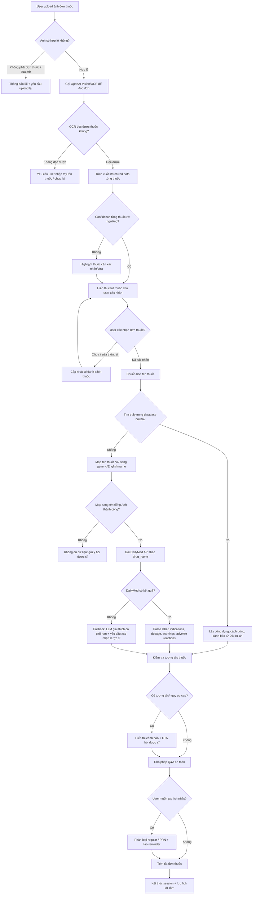

```mermaid
flowchart TD
    A[User upload ảnh đơn thuốc] --> B{Ảnh có hợp lệ không?}

    B -- Không phải đơn thuốc / quá mờ --> B1[Thông báo lỗi + yêu cầu upload lại]
    B -- Hợp lệ --> C[Gọi OpenAI Vision/OCR để đọc đơn]

    C --> D{OCR đọc được thuốc không?}
    D -- Không đọc được --> D1[Yêu cầu user nhập tay tên thuốc / chụp lại]
    D -- Đọc được --> E[Trích xuất structured data từng thuốc]

    E --> F{Confidence từng thuốc >= ngưỡng?}
    F -- Không --> F1[Highlight thuốc cần xác nhận/sửa]
    F -- Có --> G[Hiển thị card thuốc cho user xác nhận]

    F1 --> G
    G --> H{User xác nhận đơn thuốc?}

    H -- Chưa / sửa thông tin --> H1[Cập nhật lại danh sách thuốc]
    H1 --> G

    H -- Đã xác nhận --> I[Chuẩn hóa tên thuốc]

    I --> J{Tìm thấy trong database nội bộ?}
    J -- Có --> K[Lấy công dụng, cách dùng, cảnh báo từ DB dự án]
    J -- Không --> L[Map tên thuốc VN sang generic/English name]

    L --> M{Map sang tên tiếng Anh thành công?}
    M -- Không --> M1[Không đủ dữ liệu: gợi ý hỏi dược sĩ]
    M -- Có --> N[Gọi DailyMed API theo drug_name]

    N --> O{DailyMed có kết quả?}
    O -- Không --> O1[Fallback: LLM giải thích có giới hạn + yêu cầu xác nhận dược sĩ]
    O -- Có --> P[Parse label: indications, dosage, warnings, adverse reactions]

    K --> Q[Kiểm tra tương tác thuốc]
    P --> Q
    O1 --> Q

    Q --> R{Có tương tác/nguy cơ cao?}
    R -- Có --> R1[Hiển thị cảnh báo + CTA hỏi dược sĩ]
    R -- Không --> S[Cho phép Q&A an toàn]

    R1 --> S
    S --> T{User muốn tạo lịch nhắc?}

    T -- Không --> U[Tóm tắt đơn thuốc]
    T -- Có --> V[Phân loại regular / PRN + tạo reminder]

    V --> U
    U --> W[Kết thúc session + lưu lịch sử đơn]
```